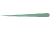

# 미니 스타크래프트 만들기-jvs
공격을 했을 때 사라지는 간단한 미니 스타크래프트를 만들어 보는 프로젝트를 하였다.   
   

일단 기본 코드는 밑에와 같이 써보았다. 
```html
<!DOCTYPE html>
<html lang="ko">
<head>
    <meta charset="UTF-8">
    <title>스타크래프트</title>
    <style>
        .background {
            position: relative;
            background-image: url('background.png');
            background-size: 500px 330px;
            width: 500px;
            height: 330px;
        }
        #drone {
            position: absolute;
            width: 100px;
            height: 100px;
            top: 100px;
            left: 60px;
        }
        #bunker {
            position: absolute;
            width: 150px;
            height: 150px;
            top: 80px;
            right: 20px;
        }
        #spit {
            display: none;
            position: absolute;
            top: 140px;
            left: 150px;
            width: 50px;
            height: 30px;
            z-index: 2;
        }
    </style>
</head>
<body>
    <div class='background'>
        
        
        
    </div>
</body>
</html>
```

drone은 왼쪽 보라색 캐릭터이고, spit는 drone을 클릭할 때 나오는 침(공격)이며, bunker는 오른쪽 벙커 캐릭터이다.   

앞서, 만들기 전에 jQuery에 대해서 알아야 한다. 
## jQuery   
: 제이쿼리는 자바스크립트 언어를 간편하게 사용할 수 있도록 단순화시킨 오픈 소스 기반의 자바스크립트 라이브러리이다.  

장점 
1. 간결한 문법
2. 편리한 API
3. 크로스 브라우징   


문법은  
```$(선택자).행위;```   로 쓰인다.

예를 들어, 
```<button id='click' onclick='hello();'> 클릭</button>``` 을    
jQuery로 바꾸면,   
```$('#click').click(hello);``` 로 간결한 문법으로 쓸 수 있다.   
그리고, 밑에 코드처럼 jQuery를 쓰기 위해 기초설정을 해주어야 한다.

```html
<script
  src="https://code.jquery.com/jquery-3.5.1.js"
  integrity="sha256-QWo7LDvxbWT2tbbQ97B53yJnYU3WhH/C8ycbRAkjPDc="
  crossorigin="anonymous"></script>

```
그런 다음, 각 동작과 효과를 써서 넣어주면 작은 미니 스타크래프를 만들 수 있다. 밑에 코드처럼 주석을 통해서 설명을 해 놓았다.   
```javascript
    <script>
        // 침맞는 횟수 변수 설정
        var hp = 3
        //jQurey를 사용하여 클릭 익명함수 작성
        $('#drone').click(function() {
            //jQurey를 사용하여 침날리는 것
            $('#spit').fadeIn();
            //jQurey를 사용하여 침날리는 동작, 현재위치에서 왼쪽간격을 250만큼 늘려주면서 침 이미지를 오른쪽으로 옮겨지는 것
            $('#spit').animate({'left': '+=250px'});
            //침이 나타났다가 사라지는 함수
            $('#spit').fadeOut(function(){
                //누를 때마다 하나씩 줄이기
                hp = hp - 1;
                //jQuery로 text로 표시
                $('#hp').text('HP: ' + hp);
                //hp==0이 되면 벙커가 사라지는 효과
                if (hp == 0) {
                    $('#bunker').fadeOut();
                }
            });
            //침을 다시 날리면 다시 원래 위치로 돌아가는 코드
            $('#spit').css({left: 150});
        });
    </script>
```    

즉, body부분의 전체 코드는 이렇다.   
```html 
<body>
    <h1 id='hp'>HP: 3</h1>
    <div class='background'>
        
        
        
    </div>
    <script
  src="https://code.jquery.com/jquery-3.5.1.js"
  integrity="sha256-QWo7LDvxbWT2tbbQ97B53yJnYU3WhH/C8ycbRAkjPDc="
  crossorigin="anonymous"></script>
    <script>
        // 침맞는 횟수 변수 설정
        var hp = 3
        //jQurey를 사용하여 클릭 익명함수 작성
        $('#drone').click(function() {
            //jQurey를 사용하여 침날리는 것
            $('#spit').fadeIn();
            //jQurey를 사용하여 침날리는 동작, 현재위치에서 왼쪽간격을 250만큼 늘려주면서 침 이미지를 오른쪽으로 옮겨지는 것
            $('#spit').animate({'left': '+=250px'});
            //침이 나타났다가 사라지는 함수
            $('#spit').fadeOut(function(){
                //누를 때마다 하나씩 줄이기
                hp = hp - 1;
                //jQuery로 text로 표시
                $('#hp').text('HP: ' + hp);
                //hp==0이 되면 벙커가 사라지는 효과
                if (hp == 0) {
                    $('#bunker').fadeOut();
                }
            });
            //침을 다시 날리면 다시 원래 위치로 돌아가는 코드
            $('#spit').css({left: 150});
        });
    </script>
</body>
```